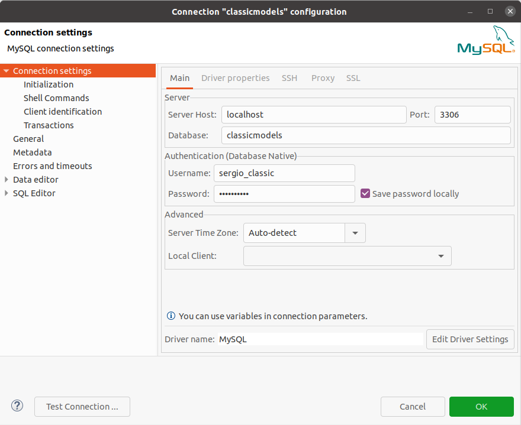

# <center> Installation and Configuration of Mysql on ubuntu 20-4 </center>


## 1. Installation

### 1.1 Update linux repos and intall mysql.
Took from [here](https://linuxhint.com/install_mysql_ubuntu_2004/)

```bash
sudo apt update
```

```bash
sudo apt install mysql-server
```

### 2. Verify MySQL service status.

```bash
$ sudo systemctl status mysql

```


### 3. Secure configuarion of MySQL.

```bash
sudo mysql_secure_installation
```
Valide password: key10NeS50

### 4. Login root to MySQL.

```bash
sudo mysql
```

Create a new database:

```bash
CREATE DATABASE SAMREENA_DB;
```

Crear usuario

```bash
CREATE USER 'sergio_prueba'@'localhost' IDENTIFIED BY 'mmTh8912$%';
```

usuario: sergio_prueba
password: mmTh8912$%

Update grant table
```bash
FLUSH PRIVILEGES;
```
It was necessary grant all PRIVILEGES to the databse user.

```bash
GRANT ALL PRIVILEGES ON SAMREENA_DB.* TO 'sergio_prueba'@'localhost';
```

## 2. Sample database downloading and load.

### 2.1. Download.

- Download the zip file from 

- Unzip the file:

 - The zip file was unzipped and stored in: `~/projects/DWforBI/BMs_essentials`

```bash
cd ~/projects/DWforBI/BMs_essentials
```


```basd
unzip mysqlsampledatabase.sql
```

### 2.2. Load the database using the CLI client.

Since the current directory is `~/projects/DWforBI/BMs_essentials` and the sql sampe is stored there:

- Start the mysql *CLI* client as `root`:

```bash
mysql -u root -p
```

- load the sql database using the `source` command

```bash
source mysqlsampledatabase.sql
```

- Check that database was loaded:

```bash
show databases;
```

```bash
mysql> show databases;
+--------------------+
| Database           |
+--------------------+
| SAMREENA_DB        |
| classicmodels      |
| information_schema |
| mysql              |
| performance_schema |
| sys                |
+--------------------+
6 rows in set (0.01 sec)
```

## 3. Database connecting using Dbeaver

- Create new user:

```bash
mysql> CREATE USER 'sergio_classic'@localhost IDENTIFIED BY 'mmTh8912$%';
```
mmTh8912$%


- Flush privileges:

```bash
mysql> FLUSH PRIVILEGES;
```

- Grant privilges


```bash
mysql> GRANT ALL PRIVILEGES ON classicmodels.* TO 'sergio_classic'@localhost;
```

- Configuring connection




- In the ssl config:


