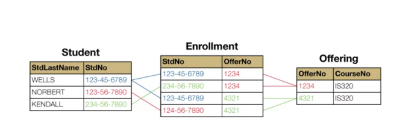
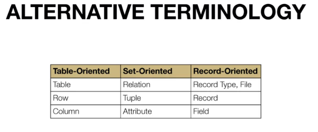
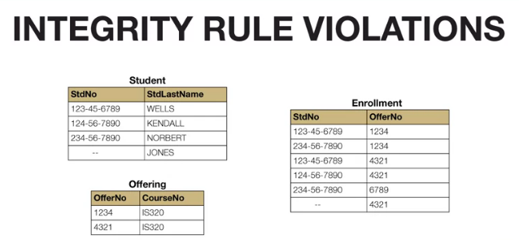
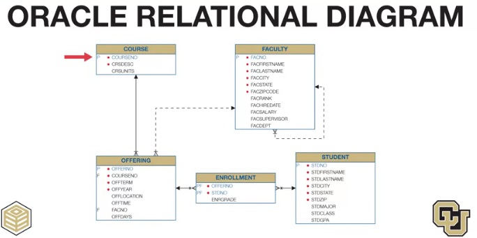
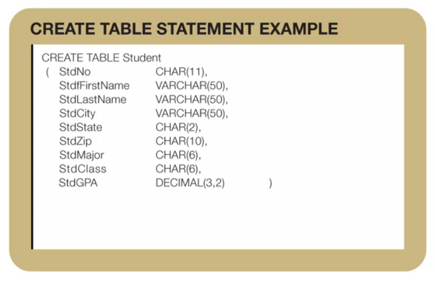
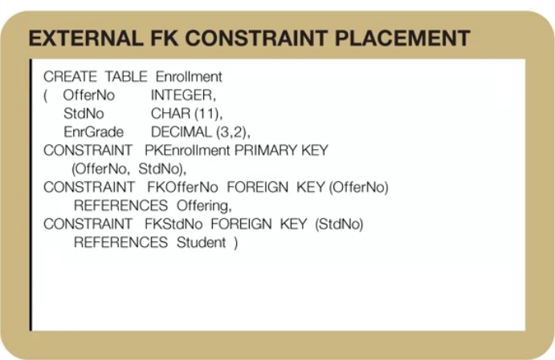
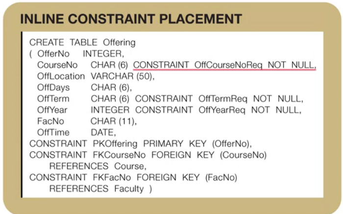

# <center>DBMS essentials week 2</center>

## 1. Basics of relational databases.

### 1.1. Terminology of databases.

-   A databases is a collection of tables.

-   Each table has a

    -   **heading**: table name and column names.
    -   **body**: shows the rows of the table.

For conventions each column name has an abbreviation of the table name
as prefix. Mixed case in a name highlights the different parts of the
column name.


-   Matching values: they are used to combine multiple tables in a
    relational database.



-   Alternative Terminology according groups of users:

    

The table-oriented terminology originally appealed to end users. The
set-oriented terminology appeals to academic researchers. And the
record-oriented terminology really was originally appealed to
information systems professionals.

Relational databases have been the dominant commercial standard in the
database industry for more than 30 years. The relational data model is
commercially dominate for several reasons.

## 2. Integrity rules:

What is the consequence of two taxpayers of customers with the same
government identifier or customer identifier?

What is the consequence of a shipment associated with the wrong order?

### 2.1. Some definitions:

-   Null values: absence of a value, unknown or not applicable for a
    row.
-   Primary Key (PK): is a **column** or **combination** of columns with
    **unique** values in each row.
-   Foreign Key (FK): is a column or combination of columns in a table
    that is related to a **primary key** in a **related table**.

### 2.2. Integrity rules:

-   **Entity Integrity rule**:

    -   PK for each table.
    -   **No part of a PK** can have missing values for PK.
    -   Ensures traceable entities.

For auditing, security, and communication reasons, business entities
should be easily traceable and unique.

-   **Referential Integrity rule**: Referential integrity means that
    column values in one table match column values in a related table.

    -   Two kinds of values for a foreign key in a row match a primary
        key value of a related table (usual).
    -   Some foreign keys can allow null values (but it is not usual).
    -   Ensures that the database contains valid connections.

For example, each row of the enrollment table contains a student number
of a valid student. Otherwise, some enrollments can be meaningless
possibly resulting in students denied enrollment because non-existing
students took their places.



> Note that StdNo is foreing key in the Enrollment table referring to
> StdNo in the Student table. And OfferNo is a foreign key in the
> Enrollment table referring to OfferNo in the

-   Integrity rule violations in the example above:

    -   StdNo has a null value on Student table being its primary key.
    -   StdNo has a null value in Enrollment and it compose a primary
        key with the OfferNo

-   Referential integrity violation:

    -   There is one OfferNo value in the Enrollment (FK in this table)
        table that is in the Offering table: 6789.

> Some foreign keys can allow null values (but it is not usual). For
> example offerings having not yet a faculty (faculty is foreign table
> in the offering table but is not part of the primary key in the
> offerings table)

### 2.3. Entity Relation Diagram:



-   Primary keys marked with a `P`.

-   Foreign Key with an F.

-   The lines represent relationships with referential integrity
    constraints.

    -   Each relationship has a parent table: appearing next to the
        **arrow** in the line.
    -   the child table appearing next to the foot symbol. This means
        that a course can related to many offerings.

-   A solid line means that the foreign key can not have missing values.

## 3. Basic SQL Create Table statement.


``` sql
 CREATE TABLE <table-name>
(<columns-list>[<constraints-list>])
```
```sql
SELECT count(*) FROM my_table;
```



### 3.1. Common SQL data types.

-   Char(L): Fixed length, L is the maximun length. It is used for
    columns with same length. IT used the maximun length.
-   VARCHAR(L): Variable length character. It not used the maximum
    length.
-   INTEGER.
-   FLOAT(P): P is the number of significant digits. Used for scientific
    calculations.
-   DECIMAL: W indicates the number of digits and R the number of places
    at the right of the decimal point. Used for monetary amounts.
-   DATES, TIME, TIMESTAMP.

## 4. Integrity Constraint Syntax.

### 4.1 Constraint Overview:

Subject:

-   PK
-   FK
-   Unique
-   Required (Not Null)
-   Check (multiple conditions.)

Placement: - Internal - External

... to the column definition.

Constraints involving more than one column must be placed external to
column.

The keyword constraint is optional for inline constraints, but required
for external constraints.

Examples:


These two constraints are internal but it could be internal because the
involves only single a column.



The last 2 constraints could be internal but the first one must be
external.



Not null constraints are typically inline because they involve single
columns
